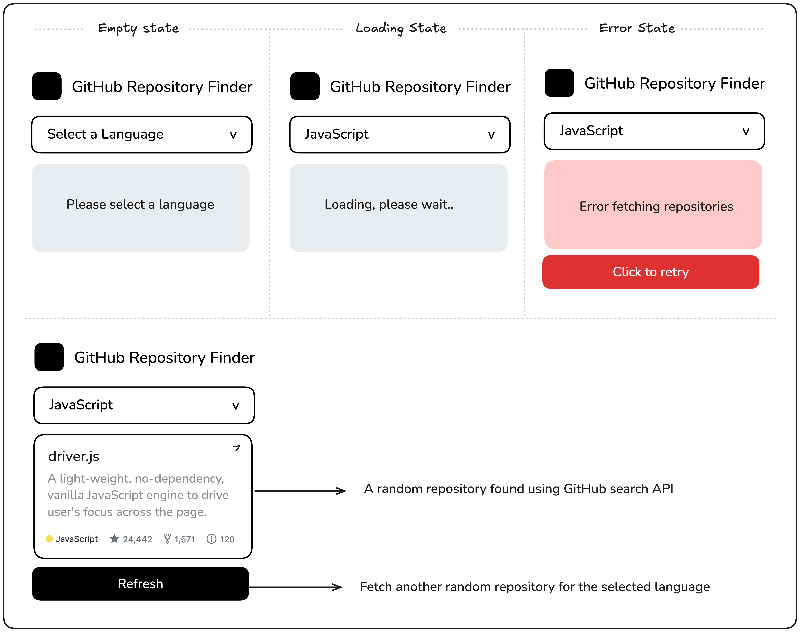

# GitHub Random Repository

Create a GitHub random repository finder using GitHub API.

https://roadmap.sh/projects/github-random-repo

# Requirements

This project is designed to introduce you to working with external APIs, handling asynchronous requests, and managing different UI states with JavaScript.

You will create a GitHub repository finder that allows users to select a programming language from a dropdown menu. The app will then use the GitHub Repository Search API to fetch and display a random repository that matches the selected language. The displayed information should include the repository name, description, number of stars, forks, and open issues. Users can fetch another random repository with a button click.

The application should handle loading, empty, and error states effectively. After successfully fetching a repository, a “Refresh” button should appear to allow users to get another random repository.

Here are the links to the resources you will need for this project:

[GitHub Repository Search API](https://docs.github.com/en/rest/reference/search#search-repositories)

[Programming Language Data](https://raw.githubusercontent.com/kamranahmedse/githunt/master/src/components/filters/language-filter/languages.json)

# Goals

- [x] This project will help you practice API integration, managing asynchronous data, and enhancing user experience with responsive UI states.
