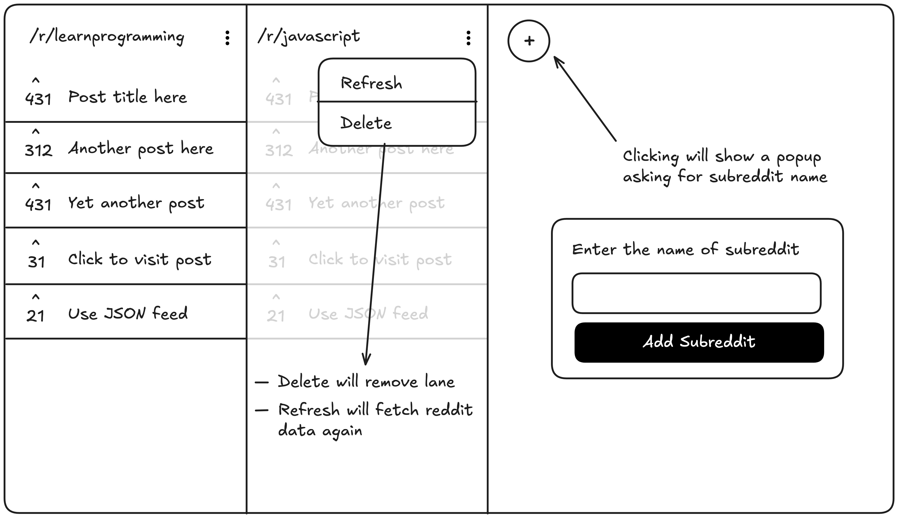

# Reddit Client

Create a Reddit client with customizable subreddit lanes.

https://roadmap.sh/projects/reddit-client

# Requirements

You are required to create a browser-based Reddit client that displays multiple subreddits in separate, customizable lanes. You’ll work with the Reddit JSON feed to fetch posts from different subreddits and display them in a dynamic, responsive layout.

The application will allow users to add new subreddit lanes by entering a subreddit name. It will verify the existence of the subreddit, fetch its posts, and display them in a new lane. Each lane will show the subreddit’s posts, including titles, authors, and vote counts.
You are required to create a browser-based Reddit client that displays multiple subreddits in separate, customizable lanes. You’ll work with the Reddit JSON feed to fetch posts from different subreddits and display them in a dynamic, responsive layout.

The application will allow users to add new subreddit lanes by entering a subreddit name. It will verify the existence of the subreddit, fetch its posts, and display them in a new lane. Each lane will show the subreddit’s posts, including titles, authors, and vote counts.

To fetch data from reddit, you can use the JSON feed available at the following URL. You can also use the Reddit API to fetch more details about the posts, such as comments, upvotes, and more.

> https://www.reddit.com/r/{subreddit}.json

The application should handle loading states while fetching data, display error messages for invalid subreddits or API issues, and provide a smooth user experience when adding or removing lanes. You can use local storage to save the user’s custom lanes and restore them when the application is reloaded.

# Goals

This project will help you practice API integration, state management, asynchronous programming, and creating a responsive, dynamic user interface. It’s an excellent opportunity to enhance your skills in frontend development and working with real-time data.
