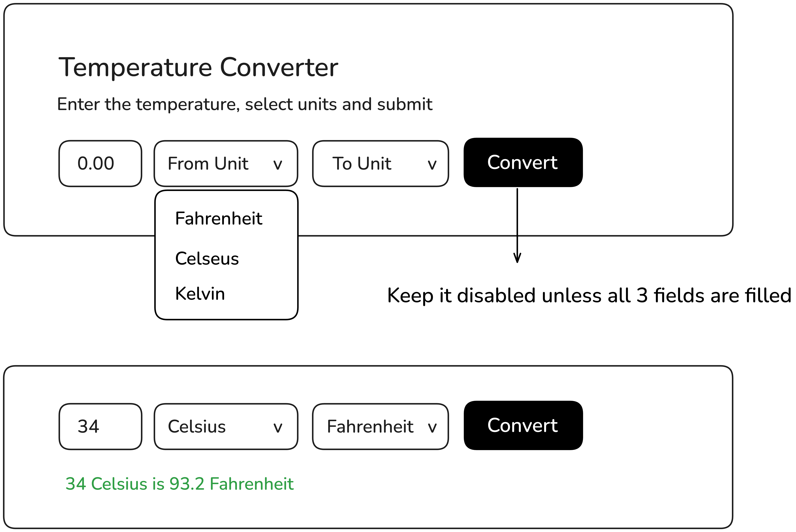

# Temperature Converter

Build a temperature converter that converts between different units.

https://roadmap.sh/projects/temperature-converter

# Requirements

This project is designed to help you practice DOM manipulation, form handling, and basic calculations in JavaScript.

You will create a temperature converter that allows users to enter a temperature value, select the unit they want to convert from, and select the unit they want to convert to. The “Convert” button should only be enabled when all three fields are filled in. Once the user clicks “Convert,” the tool will display the converted temperature below the form.

Here is a mockup of what the temperature converter might look like:

# Goals

This project will help you gain experience with handling user input, conditionally enabling form elements, and performing simple calculations using JavaScript.
